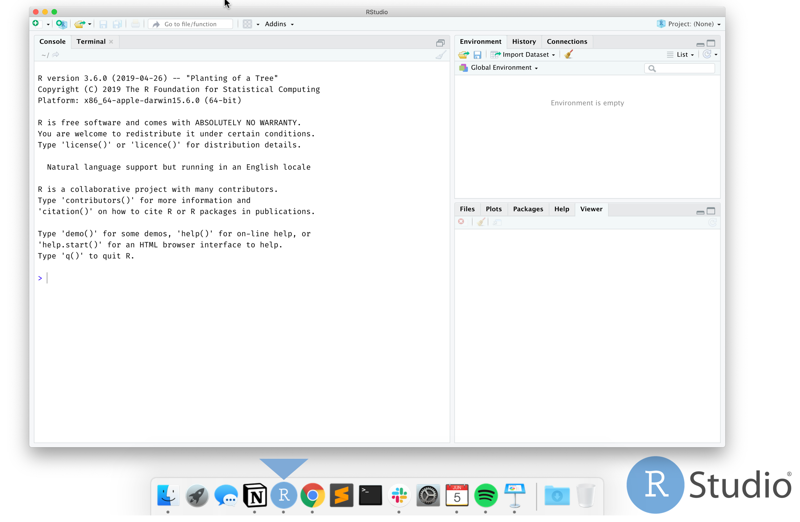
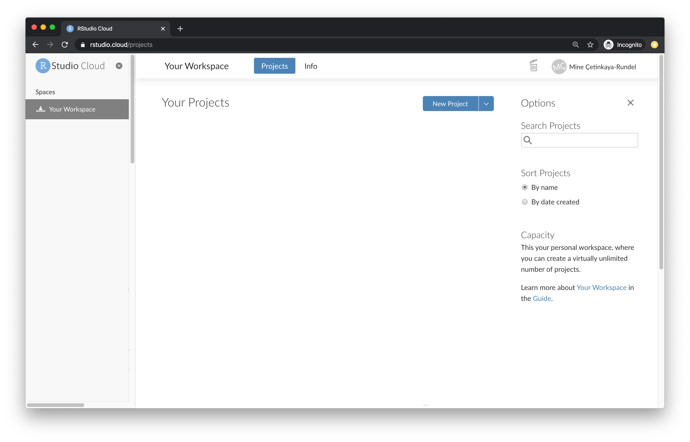
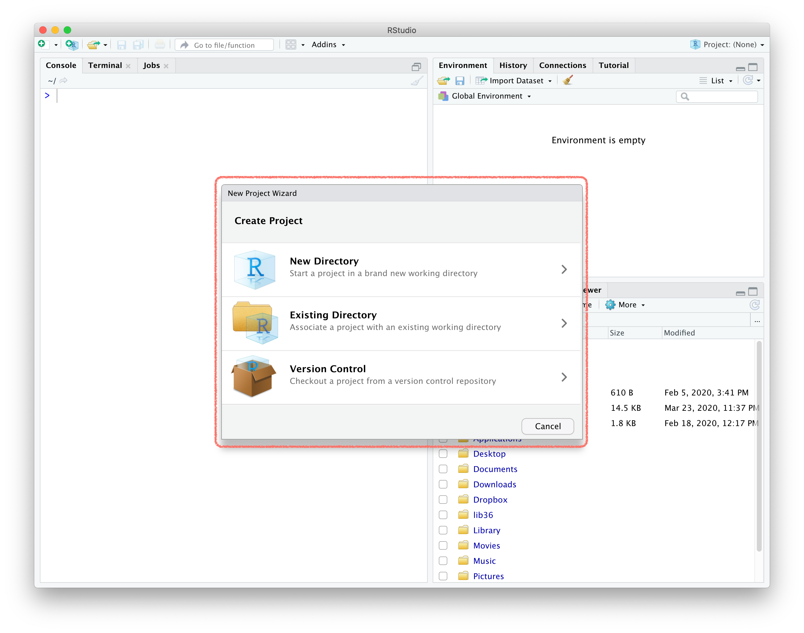
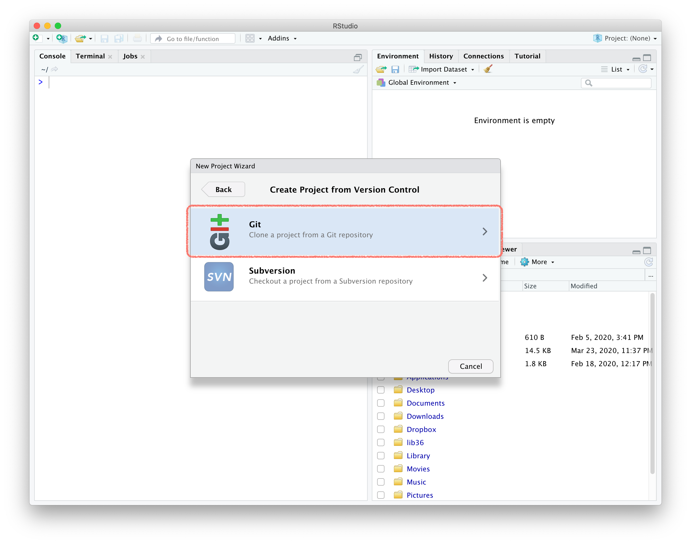
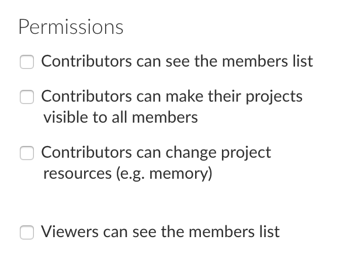
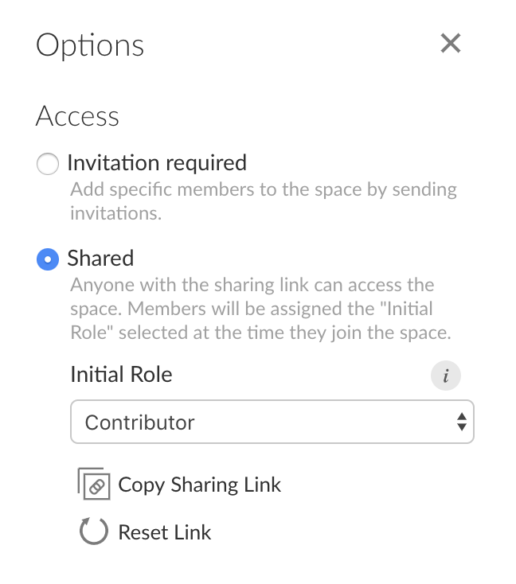

```{r setup, include = FALSE}
# R options
options(htmltools.dir.version = FALSE)

# figure height, width, dpi
knitr::opts_chunk$set(echo = TRUE, 
                      fig.width = 5, 
                      fig.height = 3,
                      dpi = 300)

# fontawesome
htmltools::tagList(rmarkdown::html_dependency_font_awesome())

# magick
dev.off <- function(){
  invisible(grDevices::dev.off())
}

# set seed
set.seed(1234)

# packages
library(countdown)
library(tidyverse)
library(broom)
library(scales)
library(openintro)
library(jsonlite)
```

class: middle

.pull-left[
  .huge-text[Why]
]
.pull-right[
  .larger[
  RStudio  
  in the cloud?
  ]
]

---

.pull-left[
### lots of friction points

- Install R
- Install RStudio
- Install the following packages:
  - rmarkdown
  - tidyverse 
  - ...
- Load these packages
- Install git
]
--
.pull-right[
### much less friction

- Go to rstudio.cloud
- Log in

```{r hello-r, eval=FALSE}
>hello R!
```
]

---

.pull-left[
### go from this
```{r computer-lab, echo=FALSE, out.width="70%", fig.alt = "Students working in a computer lab and instructor helping out."}
knitr::include_graphics("img/jonathan-borba-PZBjJ12Xv2s-unsplash.jpg")
```
]
--
.pull-right[
### to this easily
```{r laptop-at-home, echo=FALSE, out.width="80%", fig.alt = "Student working on their laptop sitting by themselves on the bed, seemingly at home."}
knitr::include_graphics("img/sincerely-media-o5Key-1HzaY-unsplash.jpg")
```
]

.footnote[
.tiny[Photos by Jonathan Borba and Sincerely Media on Unsplash.]
]

---

class: middle

.pull-left[
  .huge-text[How]
]
.pull-right[
  .larger[
  RStudio  
  in the cloud?
  ]
]

---

.pull-left[
**RStudio Server Pro** __*__  

You have...
- sysadmin experience / IT support
- hardware / local VM / cloud computing credit
- RStudio experience

.midi[See [RStudio Academic Pricing](https://rstudio.com/pricing/academic-pricing/), freely licensed for teaching purposes.]
]
.pull-right[
**RStudio Cloud**

You have...
- RStudio experience
]
  
.footnote[
.small[
__*__ Çetinkaya-Rundel, Mine, and Rundel, Colin. "Infrastructure and tools for teaching computing throughout the statistical curriculum." The American Statistician (2018). Part of the Practical Data Science for Stats collection. [[Peer J]](https://peerj.com/preprints/3181/) [[TAS]](https://doi.org/10.1080/00031305.2017.1397549)
]
]

---

class: middle

.pull-left[
  .huge-text[Hello]
]
.pull-right[
  .larger[
  RStudio  
  Cloud
  ]
]

---

## What is RStudio Cloud?

<br>

.pull-left-narrow[
```{r echo=FALSE, fig.alt = "Illustration of a blue cloud."}
knitr::include_graphics("img/cloud.png")
```
]
.pull-right-wide[
.large[We created [**RStudio Cloud**](https://rstudio.cloud/) to make it easy for professionals, hobbyists, trainers, teachers, and students to do, share, teach, and learn data science using R.]
]

---

class: middle, center

```{r echo=FALSE, out.width="100%", fig.alt = "Screenshot of the RStudio IDE locally installed on a computer."}

```

---

class: middle, center

```{r echo=FALSE, out.width="100%", fig.alt = "Screenshot of the RStudio IDE in RStudio Cloud in a browser."}
knitr::include_graphics("img/rstudio-cloud.png")
```

---

## Why RStudio Cloud?

- Does not require IT support

--
- Git works out of the box
- Knit to PDF and Word works out of the box

--
- Features designed for instructors

---

## Contexts

- Shorter workshops: Likely no opportunity to communicate pre-workshop instructions, varied computing background and learning goals

- Semester long courses
  - Intro data science / statistics: little to no background in stats, data science, programming
  - Upper level data science / statistics: Varied computing background and different computer setups

---

## RStudio Cloud: First look

```{r echo=FALSE, out.width="80%", fig.align="center", fig.alt = "Screenshot of the landing page for RStudio Cloud with no projects."}

```

---

## Workspaces

- When you create an account on RStudio Cloud you get a workspace of your own

- You can add a new workspace and control its permissions

- Projects in either workspace can be public or private

---

## A framework for workspaces

```{r echo=FALSE, out.width="90%", fig.align="center", fig.alt = "Screenshot of the landing page for RStudio Cloud with no projects, annotated with additional images. The sidebar is where workspaces are shown has a picture of a classroom and the middle area where projects in the workspace called 'your workspace' has a picture of a sandbox."}

```

---

## Projects

.pull-left[
A new project in RStudio Cloud
```{r echo=FALSE, out.width="90%", fig.align="center", fig.alt = "Screenshot of RStudio Cloud with the 'New project' button highlighted."}
knitr::include_graphics("img/new-project-cloud.png")
```
]
.pull-right[
is a new project in RStudio IDE
```{r echo=FALSE, out.width="90%", fig.align="center", fig.alt = "Screenshot of RStudio with the 'New project' window overlaid."}

```
]

.alert[
**PSA:** If you use RStudio, use projects! Trust me, you won’t regret it. Find out more on [R for Data Science](https://r4ds.had.co.nz/workflow-projects.html).
]

---

## Projects from Git

.pull-left[
A new project from Git repo in RStudio Cloud
```{r echo=FALSE, out.width="90%", fig.align="center", fig.alt = "Screenshot of RStudio Cloud with the 'New project from Git' button highlighted."}

```
]
.pull-right[
is the same as a new project from Git in RStudio IDE
```{r echo=FALSE, out.width="90%", fig.align="center", fig.alt = "Screenshot of RStudio with the 'Create project from version control' window overlaid."}

```
]

Both options `clone` a Git repo

---

## Sharing options

- Option 1: Share a single project

- Option 2: Invite users to a workspace (presumably with many projects)

---

class: middle

# Sharing option

.pull-left[
  .huge-number[1]
]
.pull-right[
  .larger[
  Single  
  project
  ]
]

---

class: middle

.center[
```{r echo=FALSE, fig.align="center", out.width="80%", fig.alt = "Screenshot of tweet that reads 'Easy peasy, it'll even fit in a tweet: Go to http://rstudio.cloud -> Login -> New Project. Install packages, add scripts, Rmds etc. Gear icon -> Access -> Everyone. Copy URL and share.'"}
knitr::include_graphics("img/cloud-setup-tweet.png")
```
]

---

class: middle

.center[
.larger[
`r emo::ji("woman_teacher")` teacher
]
.larger[
`r emo::ji("woman_technologist")` student
]
]

---

## `r emo::ji("woman_teacher")` Creating and sharing a single project

<br>

.discussion[

**Follow along!**

- Create a new project and give it a name
- Install a package of your choice
- Create a template R Markdown document in the project
- Change the access level of the project so others can see it as well
- *Optional:* Copy the project URL and share it with the rest of the group in the chat
]

---

## Pros / cons: Sharing a single project

.pull-left[
### Good!

- Students land directly in a project upon login
- Works well for workshops where all work will be completed in a single project
- Also great for sharing code in general, e.g. collaboration, reprexes, etc.
]
--
.pull-right[
### Not so good...

- Students need to remember to make a copy of the project (which means you need to remember to remind them!)
- You can't keep track which students started their assignment
- Students control permissions
- You can't easily peek into student projects -- they would need to explicitly share the project with you
]

---

class: middle

# Sharing option

.pull-left[
  .huge-number[2]
]
.pull-right[
  .larger[
  Work-    
  space
  ]
]

---

## `r emo::ji("woman_teacher")` Creating a workspace

.center[
<iframe width="896" height="504" src="https://www.youtube.com/embed/tqu1m9R1HLw" frameborder="0" allow="accelerometer; autoplay; encrypted-media; gyroscope; picture-in-picture" allowfullscreen></iframe>
]

---

## `r emo::ji("woman_teacher")` Workspace membership

```{r echo=FALSE, fig.align="center", out.width="70%", fig.alt = "Screenshot of the Members tab in an RStudio Cloud workspace. Title on the left area of the window says 'All Members', currently the only member in the workspace is Mine Çetinkaya-Rundel. Title on the left of the window says Options, which lists Access and Permissions options."}

```

---

## `r emo::ji("woman_teacher")` Role permissions

<br>

| role        | permission                                       | course role |
|-------------|--------------------------------------------------|-------------|
| admin       | manage users, view, edit and manage all projects | instructor  |
| moderator   | view, edit and manage all projects               | TA          |
| contributor | create, edit and manage their own projects       | student     |
| viewer      | view projects shared with everyone               | auditor     |

---

## `r emo::ji("woman_teacher")` Other permissions

<br>

#### Under the Members tab:

.pull-left-narrow[
```{r echo=FALSE, out.width="100%"}

```
]
.pull-right-wide[
- By default, all permissions are turned off
- Think carefully before checking these boxes
]

---

## `r emo::ji("woman_teacher")` Options

<br>

#### Under the Members tab:

.pull-left-narrow[
```{r echo=FALSE, out.width="100%"}

```
]
.pull-right-wide[
- Make workspace shared for a short period of time, share link with students, enrol them as contributors.
- After initial round of enrolment (e.g. drop/add) switch over to this access level
- Use invitations for visitors added mid-semester
]

---

## `r emo::ji("woman_teacher")` Inviting a student to a workspace

.center[
```{r echo=FALSE, out.width="70%", fig.align="center", fig.alt = "Screenshot of the Members tab in an RStudio Cloud workspace. Under Options > Access, Shared is selected. A dropdown menu shows that the initial role of someone who joins the space will be Contributor. Also highlighted is a button that says 'Copy sharing link'."}
knitr::include_graphics("img/invite-to-workspace.png")
```
]

---

## Base projects

One of the most attractive features of RStudio Cloud!

- Packages you want *installed* on all student projects

--
- Text documents you want to appear on **all** student projects (e.g. code of conduct, turn-in instructions, etc.)

--
- Applies to all projects created **after** base project has been specified, doesn't apply retroactively

--
- Can be updated as many times as you like throughout the course (without having to convince your IT!!!)

---

## `r emo::ji("woman_teacher")` Setting up your base project

.center[
<iframe width="896" height="504" src="https://www.youtube.com/embed/Fz9UR6uxAG4" frameborder="0" allow="accelerometer; autoplay; encrypted-media; gyroscope; picture-in-picture" allowfullscreen></iframe>
]

---

## Git integration

`r emo::ji("stop_sign")` Only relevant if teaching with Git & GitHub!

--

`r emo::ji("grin")` Base project template can be used, so new project from Git also has the right packages installed!

---

## Pros / cons: Sharing a workspace

.pull-left[
### Good!

- Various permission levels
- Base projects with desired packages installed
- Assignments -- no more "make a copy of the project before starting work"
- Peek into students’ projects
```{r echo=FALSE, out.width="80%", fig.align="center", fig.alt = "Screenshot of RStudio Cloud workspace with many shared projects. Highlighted is information on one of these screens that reads 'View 17 derived projects'."}

```
]
--
.pull-right[
### Not so good...

- Students land in the workspace, may need to provide instructions for the next steps
- Git config for each project can get tedious and doesn't reflect realistic practice
]

---

## Common pitfalls

- Changes you make after student launches a project under either model (single project or workspace) won’t propagate to their project

--

- Packages in the base project will be **installed** in all projects in the workspace, but not **loaded**
  - If you need students to run code in the Console that requires a package, your instructions should remind them to load the package first
  - If using Rmd document, add a `load-package` chunk on top

---

## Feedback / questions / troubleshooting

- Check out [status.rstudio.com](https://status.rstudio.com/)

- Post on [RStudio Community](https://community.rstudio.com/c/rstudio-cloud)

- Email [support@rstudio.cloud](mailto:support@rstudio.cloud)

```{r echo=FALSE, out.width="70%", fig.align="center", fig.alt = "Screenshot of RStudio Cloud workspace, with sidebar items called 'Feedback and Questions' and 'System Status' are highlighted."}

```

---

class: middle, inverse

# Parting remarks

---

## Tips

- Each project is allocated 1GB of RAM (but you can increase this!)
  - Test things out before assignments involving large datasets 

- What your students see is not always what you see
  - Create a secondary account and add as a student

---

## More tips

Make brief screencasts for getting students oriented with the platform (especially if remote teaching), or use mine! 

.center[
[Navigating RStudio Cloud on YouTube](https://www.youtube.com/playlist?list=PLNUVZZ6hfXX05Bs80Hg5MjbOPnEFmwiOM)
]

```{r echo=FALSE, out.width="50%", fig.align="center", fig.alt = "Screenshot of YouTube channel with videos for navigating RStudio Cloud."}

```

---

## More tips

.large[
[RStudio Cloud guide](https://rstudio.cloud/learn/guide)
]

<iframe width="900" height="450" src="https://rstudio.cloud/learn/guide" frameborder="0" style="background:white;"></iframe>  
  
---

## `r emo::ji("parcel")` rscloud

- You can access RStudio Cloud's API to manage space members programatically using the **rscloud** package:

- You will need to create client credentials to use the package. You can create credentials at [login.rstudio.cloud/identity](https://login.rstudio.cloud/identity).

```{r eval=FALSE}
# install.packages("rscloud")
devtools::install_github("rstudio/rscloud")
```

---

## Pricing

.large[
[rstudio.cloud/plans](https://rstudio.cloud/plans)
]

<iframe width="900" height="450" src="https://rstudio.cloud/plans/free/" frameborder="0" style="background:white;"></iframe>  
